<!-- 由 studio/zero.py 生成，别手改。改文案改 build.py 的数据，再跑 python3 studio/build.py --home zero -->

<a href="https://decli.github.io"><picture><source media="(max-width: 1151px) and (prefers-color-scheme: dark)" srcset="assets/hero-m-dark.svg"><source media="(max-width: 1151px)" srcset="assets/hero-m-light.svg"><source media="(prefers-color-scheme: dark)" srcset="assets/hero-d-dark.svg"></picture></a>

<picture><source media="(max-width: 1151px) and (prefers-color-scheme: dark)" srcset="assets/method-m-dark.svg"><source media="(max-width: 1151px)" srcset="assets/method-m-light.svg"><source media="(prefers-color-scheme: dark)" srcset="assets/method-d-dark.svg"></picture>

<a href="https://github.com/decli/codeless"><picture><source media="(max-width: 1151px) and (prefers-color-scheme: dark)" srcset="assets/codeless-m-dark.svg"><source media="(max-width: 1151px)" srcset="assets/codeless-m-light.svg"><source media="(prefers-color-scheme: dark)" srcset="assets/codeless-d-dark.svg"></picture></a>

<picture><source media="(max-width: 1151px) and (prefers-color-scheme: dark)" srcset="assets/works-m-dark.svg"><source media="(max-width: 1151px)" srcset="assets/works-m-light.svg"><source media="(prefers-color-scheme: dark)" srcset="assets/works-d-dark.svg"></picture>

<a href="https://decli.github.io/ftms/"><picture><source media="(max-width: 1151px) and (prefers-color-scheme: dark)" srcset="assets/work-ftms-m-dark.svg"><source media="(max-width: 1151px)" srcset="assets/work-ftms-m-light.svg"><source media="(prefers-color-scheme: dark)" srcset="assets/work-ftms-d-dark.svg"></picture></a><a href="https://decli.github.io/ems/"><picture><source media="(max-width: 1151px) and (prefers-color-scheme: dark)" srcset="assets/work-ems-m-dark.svg"><source media="(max-width: 1151px)" srcset="assets/work-ems-m-light.svg"><source media="(prefers-color-scheme: dark)" srcset="assets/work-ems-d-dark.svg"></picture></a><a href="https://decli.github.io/logicc/"><picture><source media="(max-width: 1151px) and (prefers-color-scheme: dark)" srcset="assets/work-logicc-m-dark.svg"><source media="(max-width: 1151px)" srcset="assets/work-logicc-m-light.svg"><source media="(prefers-color-scheme: dark)" srcset="assets/work-logicc-d-dark.svg"></picture></a><a href="https://decli.github.io/wxformat3/"><picture><source media="(max-width: 1151px) and (prefers-color-scheme: dark)" srcset="assets/work-wxformat3-m-dark.svg"><source media="(max-width: 1151px)" srcset="assets/work-wxformat3-m-light.svg"><source media="(prefers-color-scheme: dark)" srcset="assets/work-wxformat3-d-dark.svg"></picture></a><a href="https://github.com/decli/MacPleco/releases/latest"><picture><source media="(max-width: 1151px) and (prefers-color-scheme: dark)" srcset="assets/work-macpleco-m-dark.svg"><source media="(max-width: 1151px)" srcset="assets/work-macpleco-m-light.svg"><source media="(prefers-color-scheme: dark)" srcset="assets/work-macpleco-d-dark.svg"></picture></a><a href="https://github.com/decli/IP_Geolocation_Extension_Chrome"><picture><source media="(max-width: 1151px) and (prefers-color-scheme: dark)" srcset="assets/work-ip-geo-m-dark.svg"><source media="(max-width: 1151px)" srcset="assets/work-ip-geo-m-light.svg"><source media="(prefers-color-scheme: dark)" srcset="assets/work-ip-geo-d-dark.svg"></picture></a>

<picture><source media="(max-width: 1151px) and (prefers-color-scheme: dark)" srcset="assets/index-m-dark.svg"><source media="(max-width: 1151px)" srcset="assets/index-m-light.svg"><source media="(prefers-color-scheme: dark)" srcset="assets/index-d-dark.svg"></picture>

<a href="https://github.com/decli/codeless"><picture><source media="(max-width: 1151px) and (prefers-color-scheme: dark)" srcset="assets/row-codeless-m-dark.svg"><source media="(max-width: 1151px)" srcset="assets/row-codeless-m-light.svg"><source media="(prefers-color-scheme: dark)" srcset="assets/row-codeless-d-dark.svg"></picture></a><a href="https://decli.github.io/ftms/"><picture><source media="(max-width: 1151px) and (prefers-color-scheme: dark)" srcset="assets/row-ftms-m-dark.svg"><source media="(max-width: 1151px)" srcset="assets/row-ftms-m-light.svg"><source media="(prefers-color-scheme: dark)" srcset="assets/row-ftms-d-dark.svg"></picture></a><a href="https://decli.github.io/ems/"><picture><source media="(max-width: 1151px) and (prefers-color-scheme: dark)" srcset="assets/row-ems-m-dark.svg"><source media="(max-width: 1151px)" srcset="assets/row-ems-m-light.svg"><source media="(prefers-color-scheme: dark)" srcset="assets/row-ems-d-dark.svg"></picture></a><a href="https://decli.github.io/logicc/"><picture><source media="(max-width: 1151px) and (prefers-color-scheme: dark)" srcset="assets/row-logicc-m-dark.svg"><source media="(max-width: 1151px)" srcset="assets/row-logicc-m-light.svg"><source media="(prefers-color-scheme: dark)" srcset="assets/row-logicc-d-dark.svg"></picture></a><a href="https://github.com/decli/CodeHelper"><picture><source media="(max-width: 1151px) and (prefers-color-scheme: dark)" srcset="assets/row-codehelper-m-dark.svg"><source media="(max-width: 1151px)" srcset="assets/row-codehelper-m-light.svg"><source media="(prefers-color-scheme: dark)" srcset="assets/row-codehelper-d-dark.svg"></picture></a><a href="https://github.com/decli/chinesechess03"><picture><source media="(max-width: 1151px) and (prefers-color-scheme: dark)" srcset="assets/row-chinesechess-m-dark.svg"><source media="(max-width: 1151px)" srcset="assets/row-chinesechess-m-light.svg"><source media="(prefers-color-scheme: dark)" srcset="assets/row-chinesechess-d-dark.svg"></picture></a><a href="https://decli.github.io/wxformat3/"><picture><source media="(max-width: 1151px) and (prefers-color-scheme: dark)" srcset="assets/row-wxformat3-m-dark.svg"><source media="(max-width: 1151px)" srcset="assets/row-wxformat3-m-light.svg"><source media="(prefers-color-scheme: dark)" srcset="assets/row-wxformat3-d-dark.svg"></picture></a><a href="https://github.com/decli/MacPleco/releases/latest"><picture><source media="(max-width: 1151px) and (prefers-color-scheme: dark)" srcset="assets/row-macpleco-m-dark.svg"><source media="(max-width: 1151px)" srcset="assets/row-macpleco-m-light.svg"><source media="(prefers-color-scheme: dark)" srcset="assets/row-macpleco-d-dark.svg"></picture></a><a href="https://github.com/decli/IP_Geolocation_Extension_Chrome"><picture><source media="(max-width: 1151px) and (prefers-color-scheme: dark)" srcset="assets/row-ip-geo-m-dark.svg"><source media="(max-width: 1151px)" srcset="assets/row-ip-geo-m-light.svg"><source media="(prefers-color-scheme: dark)" srcset="assets/row-ip-geo-d-dark.svg"></picture></a><a href="https://github.com/decli/JobOrNot"><picture><source media="(max-width: 1151px) and (prefers-color-scheme: dark)" srcset="assets/row-jobornot-m-dark.svg"><source media="(max-width: 1151px)" srcset="assets/row-jobornot-m-light.svg"><source media="(prefers-color-scheme: dark)" srcset="assets/row-jobornot-d-dark.svg"></picture></a><a href="https://github.com/decli/weixin_public_export"><picture><source media="(max-width: 1151px) and (prefers-color-scheme: dark)" srcset="assets/row-wx-export-m-dark.svg"><source media="(max-width: 1151px)" srcset="assets/row-wx-export-m-light.svg"><source media="(prefers-color-scheme: dark)" srcset="assets/row-wx-export-d-dark.svg"></picture></a><a href="https://github.com/decli/TabInfoCopy"><picture><source media="(max-width: 1151px) and (prefers-color-scheme: dark)" srcset="assets/row-tabinfocopy-m-dark.svg"><source media="(max-width: 1151px)" srcset="assets/row-tabinfocopy-m-light.svg"><source media="(prefers-color-scheme: dark)" srcset="assets/row-tabinfocopy-d-dark.svg"></picture></a><a href="https://github.com/decli/pagescroll"><picture><source media="(max-width: 1151px) and (prefers-color-scheme: dark)" srcset="assets/row-pagescroll-m-dark.svg"><source media="(max-width: 1151px)" srcset="assets/row-pagescroll-m-light.svg"><source media="(prefers-color-scheme: dark)" srcset="assets/row-pagescroll-d-dark.svg"></picture></a><a href="https://github.com/decli/BingWDByte4KBatchDownloader"><picture><source media="(max-width: 1151px) and (prefers-color-scheme: dark)" srcset="assets/row-bing-wallpaper-m-dark.svg"><source media="(max-width: 1151px)" srcset="assets/row-bing-wallpaper-m-light.svg"><source media="(prefers-color-scheme: dark)" srcset="assets/row-bing-wallpaper-d-dark.svg"></picture></a><a href="https://github.com/decli/IPDisplayExtension"><picture><source media="(max-width: 1151px) and (prefers-color-scheme: dark)" srcset="assets/row-ip-display-m-dark.svg"><source media="(max-width: 1151px)" srcset="assets/row-ip-display-m-light.svg"><source media="(prefers-color-scheme: dark)" srcset="assets/row-ip-display-d-dark.svg"></picture></a>

<picture><source media="(max-width: 1151px) and (prefers-color-scheme: dark)" srcset="assets/beliefs-m-dark.svg"><source media="(max-width: 1151px)" srcset="assets/beliefs-m-light.svg"><source media="(prefers-color-scheme: dark)" srcset="assets/beliefs-d-dark.svg"></picture>

<a href="https://decli.github.io"><picture><source media="(max-width: 1151px) and (prefers-color-scheme: dark)" srcset="assets/colophon-m-dark.svg"><source media="(max-width: 1151px)" srcset="assets/colophon-m-light.svg"><source media="(prefers-color-scheme: dark)" srcset="assets/colophon-d-dark.svg"></picture></a>
