# 这个仓库是什么

<https://github.com/decli> 个人主页上显示的那份 README，以及生成它的代码。

视觉语言取自作品集 <https://decli.github.io/>：配色是把首页亮暗两套 CSS 变量原样搬过来的，
首屏那句「十五个作品，一行代码没写」一字没改，作品图标也是从各项目借来的 favicon。
GitHub 上和作品集里，看起来是同一个人的东西。

```
README.md        个人主页（极光风格）—— build.py 生成，别手改
assets/          README 里用到的 SVG，亮暗各一份
build.py         生成器：作品数据、配色、三套风格的画法都在这一个文件里
src/icons/       从各项目借来的图标
styles/          另外两套备选：terminal/、bento/
docs/            本说明
```

> **仓库名必须是 `decli`，个人主页才会显示它。** GitHub 只认跟用户名一字不差的公开仓库，
> 读它根目录下的 `README.md`。现在叫 `GitHubHomePage` 的话，主页上什么都不会出现。
> 改名：仓库 Settings → General → Repository name 改成 `decli` → Rename。
> 改完 GitHub 会把旧地址自动跳到新地址；README 里的图片全是相对路径，改名不受影响。

---

## 加一个作品

只改 [`build.py`](../build.py) 里的 `WORKS`，然后：

```sh
python3 build.py            # 三套全生成
python3 build.py aurora     # 只生成一套
```

卡片、作品表、首屏的「十五个作品」和「15 / 4 / 0」全跟着数据走。只用标准库，不用装任何东西。
极光风格里哪几个作品上卡片、怎么分组，在 `AURORA_SECTIONS` 里改。

## 换一套风格

改 `build.py` 顶上的 `HOME_STYLE`（`aurora` / `terminal` / `bento`），再跑一次 `python3 build.py`。
选中的那套生成到根目录，另外两套挪到 `styles/` 下。

### 极光 Aurora（正在用）

<a href="../"><picture><source media="(prefers-color-scheme: dark)" srcset="../assets/hero-dark.svg"></picture></a>

跟作品集首页同源：深海军蓝底，三团缓慢漂浮的紫、青色斑，几条风线，渐变标题，玻璃卡片。
作品按「替谁做的」分组：外贸生意、顺手的小工具、给身边的人。codeless 单独一张横幅，
右边那条流水线是 POC 真实跑出来的一次（咖啡店官网，13 次模型调用，$0.0127）。
亮暗两套，跟着看的人在 GitHub 上选的主题切。

### 终端 Terminal

<a href="../styles/terminal/"></a>

一个会自己敲字的 zsh 窗口：`whoami` → `cat manifesto.md` → `ls works/ --live` →
`tail codeless/poc.log` → `wc -l handwritten/*`，最后一行是 `0 total`。
只播一遍，停在闪烁的光标上。日志里那三行也是 POC 的实测数据。

### 便当格 Bento

<a href="../styles/bento/"><picture><source media="(prefers-color-scheme: dark)" srcset="../styles/bento/assets/bento-dark.svg"></picture></a>

一张名片，一屏看完：我是谁、15 个作品、0 行手写代码、codeless、四个在线就能玩的、
作品分布、去作品集的入口。下面只留一行链接和一张折叠起来的全部作品表。

|  | 极光 | 终端 | 便当格 |
| --- | --- | --- | --- |
| 气质 | 作品集的延续 | 工程师味 | 名片 / 发布会 |
| 信息量 | 最多：9 张作品卡 + 全表 + 我相信的几件事 | 中 | 最少，一屏 |
| 手机上 | 卡片两两一排，字会小一些；全表是文本，照样好读 | 整张图缩小，字偏小 | 整张图缩小，字偏小 |
| 亮 / 暗主题 | 两套 | 终端本来就是暗的，一套 | 两套 |

---

## 几个不显眼但重要的地方

**为什么全是 SVG。** GitHub 渲染 README 时会剥掉 `<style>`、`class`、`style` 属性和所有脚本，
能留下来的只有图片和少数几个标签。但 SVG 当图片用的时候，它内部的 CSS 动画照样跑 ——
所以「极光在飘、风线在走、在线的小绿点在呼吸」只能画进 SVG 里。

**要读的字不画进图里。** 图里的字读屏读不到、手机上还会跟着整张图缩小。所以每张图都带完整的 alt，
作品清单、链接、「我相信的几件事」一律是 Markdown 文本。

**字宽只能估。** SVG 当图片加载时拿不到任何外部资源（包括 Google Fonts），只能用看的人机器上有的字体。
中文按 1em 算、西文按常见无衬线字体的均值算，凡是「接在一段字后面」的东西都留了余量。
终端里命令和提示符分两列放，也是因为等宽字体在不同系统上宽度不一，挤在一起会互相压。

**动效克制。** 跟作品集一个原则：一眼能看出「在动」就已经太重了。色斑一圈要 40～52 秒，
终端只播一遍。系统开了「减少动态效果」的，所有动画都不播，内容一个不少。

**压白字的色块用饱和色。** 按钮、头像、AI 标签、作品集入口这几块，暗色主题下也用亮色主题那组
brand 色 —— 暗色主题的 brand 偏浅，白字压上去对比度不到 3:1。

**没放 github-readme-stats 那类统计卡。** 第三方服务时不时挂，而且星数、提交数不是这里想讲的事。
这里的数字只有三个：15 个作品、4 个可在线体验、0 行手写代码。

**没放邮箱。** 作品集页脚特意把邮箱画在 canvas 上防爬虫，这里也不放明文。

**数字都有出处。** codeless 流水线和终端日志里的调用次数、成本，全部来自 codeless 仓库
[`docs/06-poc-findings.md`](https://github.com/decli/codeless/blob/main/docs/06-poc-findings.md) 的实测；
「我相信的几件事」是从作品集 README 的原话里提炼的。
