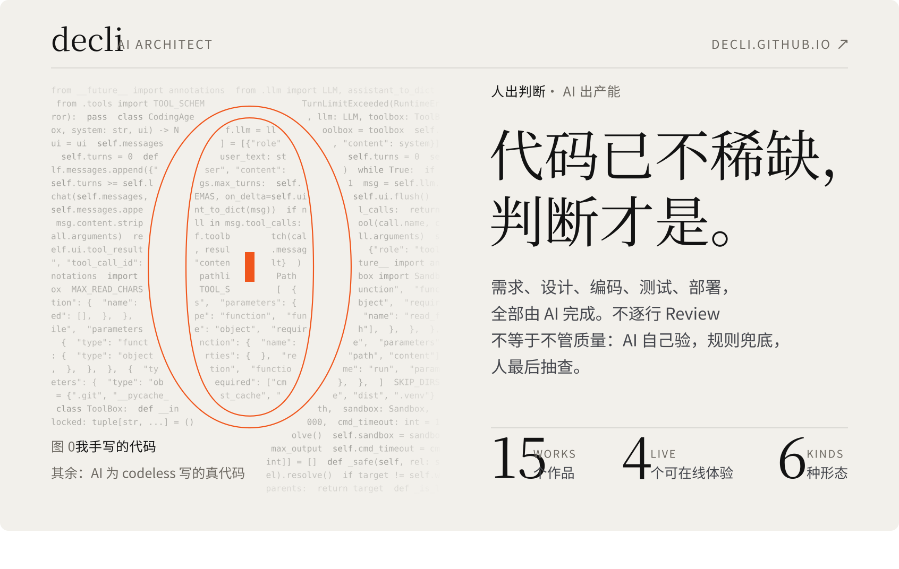
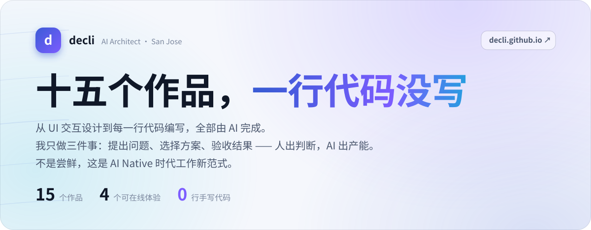
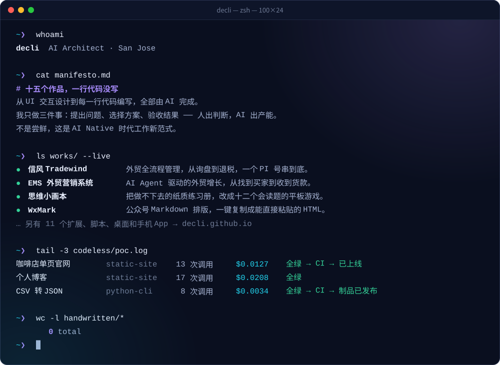
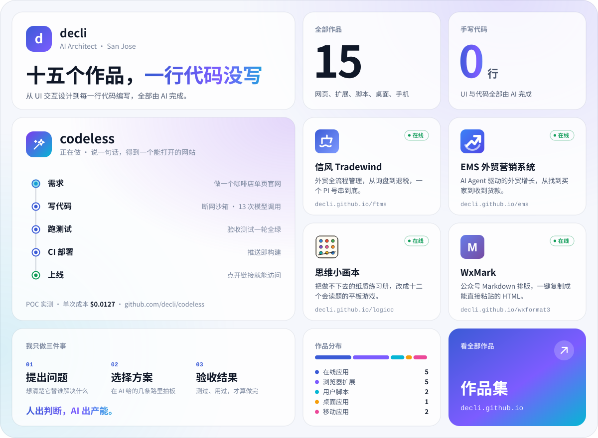

# 这个仓库是什么

<https://github.com/decli> 个人主页上显示的那份 README，以及生成它的代码。

现在主页上的是第二代的 **长卷**：一卷从右往左看的山水。山是 AI 写下的代码 ——
近处的山就是画出那张截图的源文件，竖排着灌进山形里；远山的轮廓是十五个仓库全部八万多行代码的行长。
卷上的朱印是我盖的：一件作品一方，验过了才盖。AI 出产能、人出判断，换成这个媒介，正好是一卷画和画上的印。
首屏那句「一行代码没写」跟作品集 <https://decli.github.io/> 一字不差。

```
README.md        个人主页（长卷）—— studio/build.py --home scroll 生成，别手改
assets/          README 里用到的 SVG：桌面 / 手机 × 亮 / 暗，每张四份
build.py         作品数据（WORKS / POC / PRINCIPLES …，两代共用）+ 第一代三套风格的画法
studio/          第二代生成器：长卷 / 零 · 灰与橙 / 极光 Pro，排版规矩写在 studio/README.md
src/icons/       从各项目借来的图标
styles/          备选：第二代 scroll/、zero/、aurora-pro/；第一代 aurora/、terminal/、bento/、arcade/、chat/、editorial/
docs/            本说明
```

> **个人主页要显示它，得同时满足两件事：**
>
> 1. 仓库名跟用户名一字不差（`decli/decli`），而且是公开的。GitHub 只读这个仓库根目录下的 `README.md`。
> 2. 在仓库首页右侧那块「decli/decli is now a special repository」里点 **Share to Profile**。
>    只改名不点这一下，主页还是默认样式 —— 这一步很容易漏。
>
> README 里的图片全是相对路径，仓库改名、换分支浏览都不受影响。

---

## 加一个作品

改 [`build.py`](../build.py) 里的 `WORKS`，再在 [`studio/zero.py`](../studio/zero.py) 的 `ORDER` 里给它排个位置
（漏了 build 会直接报错提醒），然后：

```sh
pip install fonttools brotli pillow     # 第一次
python3 studio/build.py --home scroll   # 主页 + styles/ 下三套第二代
python3 build.py                      # 第一代三套（只在 styles/ 下）
```

长卷里的签条、江山图上的山和地名签、题跋里的印谱都跟着数据走；印文没写的，取名字里的前两个汉字。
想让它在长卷里上一整段，改 [`studio/scroll.py`](../studio/scroll.py) 的 `FEATURED`
（「零」是 `zero.py` 的 `FEATURED`），再在 [`studio/content.py`](../studio/content.py) 的 `SHOT` 里给它定一块截图。
文案里出现母版字体里没有的字，build 会报错，按提示带上原始字体重切一次母版。

## 换一套风格

第二代三套：`python3 studio/build.py --home scroll`、`--home zero` 或 `--home aurora-pro`，选中的那套生成到根目录。
对比见 [`styles/README.md`](../styles/README.md)。

第一代的想换回主页：把 `build.py` 顶上的 `HOME_STYLE` 从 `None` 改成 `aurora` / `terminal` / `bento`，
再跑 `python3 build.py`。平时它是 `None`，只往 `styles/` 下写，不会盖掉根目录的主页。

### 长卷（正在用）

<a href="../"><picture><source media="(prefers-color-scheme: dark)" srcset="../assets/hero-d-dark.svg"></picture></a>

引首是行楷的「一行代码 / 没写」，旁边朱丝栏里竖写着引言，最左一笔账：我写的代码〇行，AI 写的八万零八十四行。
往下是十五个仓库连成的一整幅江山（山的轮廓是每一行代码的长度），六段作品（截图挂在天上，
底下的山是画出这一屏的源代码，凑近了能读），十五张签条，最后是题跋和十五方印的印谱。
整卷放在同一个 `<p>` 里，图和图之间没有缝，从上到下是一张纸。画法见 [`studio/README.md`](../studio/README.md)。

### 零 · 灰与橙（在 [`styles/zero/`](../styles/zero/)）

<a href="../styles/zero/"><picture><source media="(prefers-color-scheme: dark)" srcset="../styles/zero/assets/hero-d-dark.svg"></picture></a>

铺满一屏 codeless 仓库里 AI 写的真代码，按整字挖出一个「0」—— 只挖笔画那一圈，0 里照样是代码，
正中一个从不打字的光标。往下是方法（人只在三个点上做判断）、codeless 的一次实测（$0.0127）、
六件精选作品的真截图、全部十五件的索引、我相信的两件事、版权页。

### 极光 Aurora（第一代，在 [`styles/aurora/`](../styles/aurora/)）

<a href="../styles/aurora/"><picture><source media="(prefers-color-scheme: dark)" srcset="../styles/aurora/assets/hero-dark.svg"></picture></a>

跟作品集首页同源：深海军蓝底，三团缓慢漂浮的紫、青色斑，几条风线，渐变标题，玻璃卡片。
作品按「替谁做的」分组：外贸生意、顺手的小工具、给身边的人。codeless 单独一张横幅，
右边那条流水线是 POC 真实跑出来的一次（咖啡店官网，13 次模型调用，$0.0127）。
亮暗两套，跟着看的人在 GitHub 上选的主题切。

### 终端 Terminal

<a href="../styles/terminal/"></a>

一个会自己敲字的 zsh 窗口：`whoami` → `cat manifesto.md` → `ls works/ --live` →
`tail codeless/poc.log` → `wc -l handwritten/*`，最后一行是 `0 total`。
只播一遍，停在闪烁的光标上。日志里那三行也是 POC 的实测数据。

### 便当格 Bento

<a href="../styles/bento/"><picture><source media="(prefers-color-scheme: dark)" srcset="../styles/bento/assets/bento-dark.svg"></picture></a>

一张名片，一屏看完：我是谁、15 个作品、0 行手写代码、codeless、四个在线就能玩的、
作品分布、去作品集的入口。下面只留一行链接和一张折叠起来的全部作品表。

|  | 极光 | 终端 | 便当格 |
| --- | --- | --- | --- |
| 气质 | 作品集的延续 | 工程师味 | 名片 / 发布会 |
| 信息量 | 最多：9 张作品卡 + 全表 + 我相信的几件事 | 中 | 最少，一屏 |
| 手机上 | 卡片两两一排，字会小一些；全表是文本，照样好读 | 整张图缩小，字偏小 | 整张图缩小，字偏小 |
| 亮 / 暗主题 | 两套 | 终端本来就是暗的，一套 | 两套 |

### 更大胆的三套：换的是「人和主页怎么互动」

[`styles/`](../styles/) 下还有三套实验风格，每套都自带能跑的交互：

- **[街机 · 人机对弈](../styles/arcade/)**：访客点棋盘和 AI 下五子棋，issue + Action 驱动，像素风。
- **[对话 · AI 分身](../styles/chat/)**：可以点着往下展开的对话树；想问别的，开 issue 由 AI 回。
- **[刊物 · 零行](../styles/editorial/)**：每天清晨自己出一期的杂志，明暗主题各是一版。

对比和上线方法见 [`styles/README.md`](../styles/README.md)。

---

## 几个不显眼但重要的地方（第一代）

第二代换了做法：字体按页切子集嵌进 SVG、字宽按字体文件量出来、手机单独排一版 ——
下面「字宽只能估」「手机上字偏小」那些限制在第二代里都不存在了，细节见 [`studio/README.md`](../studio/README.md)。

**为什么全是 SVG。** GitHub 渲染 README 时会剥掉 `<style>`、`class`、`style` 属性和所有脚本，
能留下来的只有图片和少数几个标签。但 SVG 当图片用的时候，它内部的 CSS 动画照样跑 ——
所以「极光在飘、风线在走、在线的小绿点在呼吸」只能画进 SVG 里。

**要读的字不画进图里。** 图里的字读屏读不到、手机上还会跟着整张图缩小。所以每张图都带完整的 alt，
作品清单、链接、「我相信的几件事」一律是 Markdown 文本。

**字宽只能估。** SVG 当图片加载时拿不到任何外部资源（包括 Google Fonts），只能用看的人机器上有的字体。
中文按 1em 算、西文按常见无衬线字体的均值算，凡是「接在一段字后面」的东西都留了余量。
终端里命令和提示符分两列放，也是因为等宽字体在不同系统上宽度不一，挤在一起会互相压。

**动效克制。** 跟作品集一个原则：一眼能看出「在动」就已经太重了。色斑一圈要 40～52 秒，
终端只播一遍。系统开了「减少动态效果」的，所有动画都不播，内容一个不少。

**压白字的色块用饱和色。** 按钮、头像、AI 标签、作品集入口这几块，暗色主题下也用亮色主题那组
brand 色 —— 暗色主题的 brand 偏浅，白字压上去对比度不到 3:1。

**没放 github-readme-stats 那类统计卡。** 第三方服务时不时挂，而且星数、提交数不是这里想讲的事。
这里的数字只有三个：15 个作品、4 个可在线体验、0 行手写代码。

**没放邮箱。** 作品集页脚特意把邮箱画在 canvas 上防爬虫，这里也不放明文。

**数字都有出处。** codeless 流水线和终端日志里的调用次数、成本，全部来自 codeless 仓库
[`docs/06-poc-findings.md`](https://github.com/decli/codeless/blob/main/docs/06-poc-findings.md) 的实测；
「我相信的几件事」是从作品集 README 的原话里提炼的。
