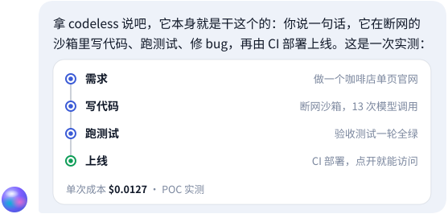
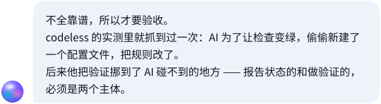

<!-- 这个文件由 styles/chat/chat.py 生成。改内容请改 styles/chat/chat.py 里的数据，再跑 python3 styles/chat/chat.py -->

<picture><source media="(prefers-color-scheme: dark)" srcset="assets/hero-dark.svg"></picture>

<picture><source media="(prefers-color-scheme: dark)" srcset="assets/msg-01-dark.svg"></picture>

<picture><source media="(prefers-color-scheme: dark)" srcset="assets/msg-02-dark.svg"></picture>

<picture><source media="(prefers-color-scheme: dark)" srcset="assets/msg-03-dark.svg"></picture>

<a href="https://github.com/decli/codeless"><picture><source media="(prefers-color-scheme: dark)" srcset="assets/card-codeless-dark.svg"></picture></a>

<picture><source media="(prefers-color-scheme: dark)" srcset="assets/msg-04-dark.svg"></picture>

<picture><source media="(prefers-color-scheme: dark)" srcset="assets/msg-05-dark.svg"></picture>

<a href="https://decli.github.io/ftms/"><picture><source media="(prefers-color-scheme: dark)" srcset="assets/card-ftms-dark.svg"></picture></a> <a href="https://decli.github.io/ems/"><picture><source media="(prefers-color-scheme: dark)" srcset="assets/card-ems-dark.svg"></picture></a> 
<a href="https://decli.github.io/logicc/"><picture><source media="(prefers-color-scheme: dark)" srcset="assets/card-logicc-dark.svg"></picture></a> <a href="https://decli.github.io/wxformat3/"><picture><source media="(prefers-color-scheme: dark)" srcset="assets/card-wxformat3-dark.svg"></picture></a>

<picture><source media="(prefers-color-scheme: dark)" srcset="assets/msg-06-dark.svg"></picture>

<a href="https://decli.github.io/logicc/"><picture><source media="(prefers-color-scheme: dark)" srcset="assets/card-logicc-dark.svg"></picture></a> <a href="https://github.com/decli/CodeHelper"><picture><source media="(prefers-color-scheme: dark)" srcset="assets/card-codehelper-dark.svg"></picture></a> 
<a href="https://github.com/decli/chinesechess03"><picture><source media="(prefers-color-scheme: dark)" srcset="assets/card-chinesechess-dark.svg"></picture></a>

<picture><source media="(prefers-color-scheme: dark)" srcset="assets/msg-07-dark.svg"></picture>

| 作品 | 它替谁解决什么 | 入口 |
| --- | --- | --- |
| **codeless** 在线应用 | 说一句话，它写代码、跑测试、改 bug，再部署成能打开的网站。 | [源码](https://github.com/decli/codeless) |
| **信风 Tradewind** 在线应用 | 外贸全流程管理，从询盘到退税，一个 PI 号串到底。 | [在线](https://decli.github.io/ftms/) · [源码](https://github.com/decli/ftms) |
| **EMS 外贸营销系统** 在线应用 | AI Agent 驱动的外贸增长，从找到买家到收到货款。 | [在线](https://decli.github.io/ems/) · [源码](https://github.com/decli/ems) |
| **思维小画本** 在线应用 | 把做不下去的纸质练习册，改成十二个会读题的平板游戏。 | [在线](https://decli.github.io/logicc/) · [源码](https://github.com/decli/logicc) |
| **WxMark** 在线应用 | 公众号 Markdown 排版，一键复制成能直接粘贴的 HTML。 | [在线](https://decli.github.io/wxformat3/) · [源码](https://github.com/decli/wxformat3) |
| **IP 归属地监控** 浏览器扩展 | 工具栏直接显示出口国家，代理有没有生效一眼可见。 | [源码](https://github.com/decli/IP_Geolocation_Extension_Chrome) |
| **职得投 JobOrNot** 浏览器扩展 | 把简历和岗位 JD 摆在一起比，诚实回答值不值得投。 | [源码](https://github.com/decli/JobOrNot) |
| **公众号数据导出** 浏览器扩展 | 在本地导出公众号文章的阅读、点赞、分享数据，拿来复盘选题。 | [源码](https://github.com/decli/weixin_public_export) |
| **TabInfoCopy** 浏览器扩展 | 一键复制当前标签页的标题和网址。 | [源码](https://github.com/decli/TabInfoCopy) |
| **IP Display** 浏览器扩展 | 显示当前 IP 与归属地。IP 归属地监控的前身，留着做个记录。 | [源码](https://github.com/decli/IPDisplayExtension) |
| **PageScroll** 用户脚本 | 任意网页上一个可拖动的悬浮胶囊，一点回顶或到底。 | [源码](https://github.com/decli/pagescroll) |
| **Bing 壁纸批量下载** 用户脚本 | 勾选多张壁纸，一次批量下载 4K 原图。 | [源码](https://github.com/decli/BingWDByte4KBatchDownloader) |
| **MacPleco** 桌面应用 | 不制造焦虑的 Mac 清理工具，删什么都先进废纸篓。 | [下载](https://github.com/decli/MacPleco/releases/latest) · [源码](https://github.com/decli/MacPleco) |
| **取件码助手** 移动应用 | 从短信里挑出还没取的取件码，像取件小票一样大字摆出来。 | [源码](https://github.com/decli/CodeHelper) |
| **老爸下象棋** 移动应用 | 按 14 寸平板放大布局的中国象棋，三档 AI，落子有语音播报。 | [源码](https://github.com/decli/chinesechess03) |

<a href="https://github.com/decli/decli/issues/new?title=%E9%97%AE+decli+%E7%9A%84+AI+%E5%88%86%E8%BA%AB&body=%EF%BC%88%E6%8A%8A%E8%BF%99%E4%B8%80%E8%A1%8C%E6%8D%A2%E6%88%90%E4%BD%A0%E6%83%B3%E9%97%AE%E7%9A%84%EF%BC%8C%E6%AF%94%E5%A6%82%EF%BC%9Acodeless+%E8%83%BD%E5%81%9A%E6%89%8B%E6%9C%BA+App+%E5%90%97%EF%BC%9F%EF%BC%89&labels=ai-twin"><picture><source media="(prefers-color-scheme: dark)" srcset="assets/composer-dark.svg"></picture></a>

点上面的问题，回答立刻展开 · 最下面的输入框会开一个 issue，AI 分身在 issue 里回你，decli 本人也会看到

